<picture>
  <source media="(prefers-color-scheme: dark)" srcset="assets/banner.svg">
  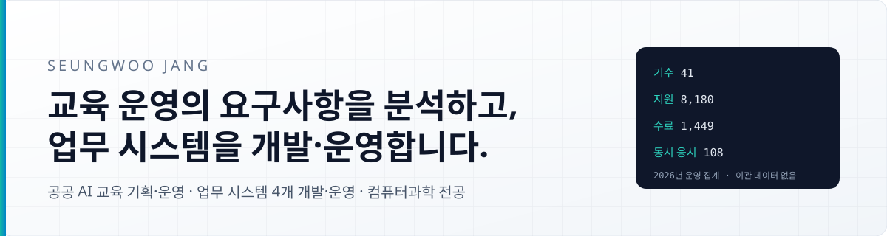
</picture>

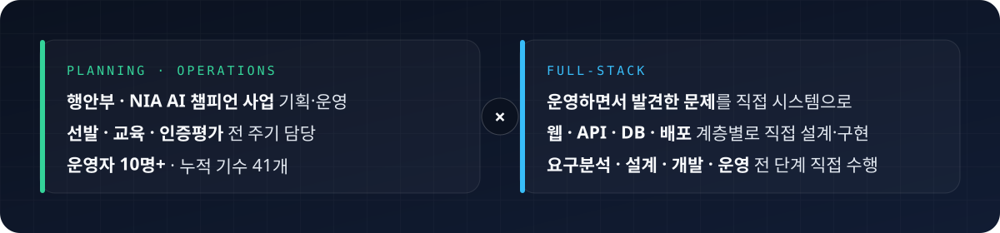

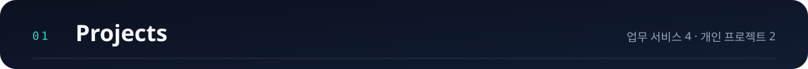

<table width="100%">
  <tr>
    <td>
      <a href="https://github.com/SSEUNGSSEUNGWOO/kbrain-ems">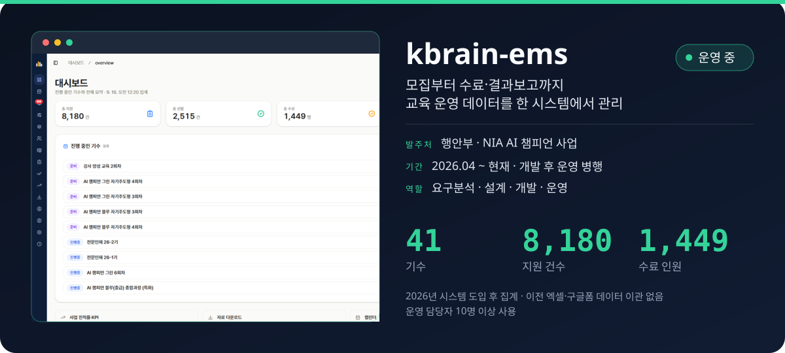</a>
      <b><a href="https://github.com/SSEUNGSSEUNGWOO/kbrain-ems">kbrain-ems</a></b> — 엑셀·구글폼으로 운영하던 교육 사업이 기수·운영자 모두 늘면서 한 시스템으로 옮겼다. 설계 결정과 테이블 29개 설명은 저장소 <a href="https://github.com/SSEUNGSSEUNGWOO/kbrain-ems/blob/main/CLAUDE.md">CLAUDE.md</a>.
    </td>
  </tr>
</table>

<table width="100%">
  <tr>
    <td>
      <a href="https://github.com/SSEUNGSSEUNGWOO/kbrain-cert">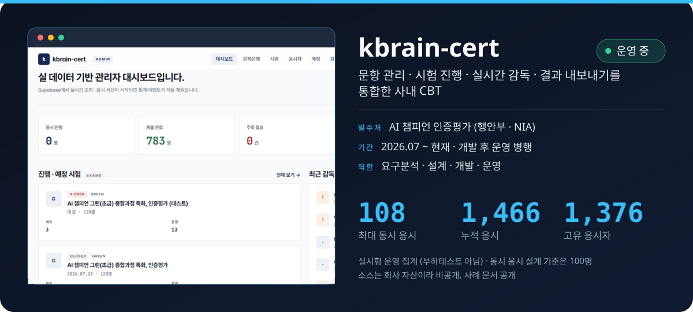</a>
      <b><a href="https://github.com/SSEUNGSSEUNGWOO/kbrain-cert">kbrain-cert</a></b> — 외부 코드로 운영하던 인증평가에서 반복된 문제(감독 오탐, 정답 노출, 점수 표기, 타이머)를 설계 단계에서 다르게 풀었다. 결정 근거는 <a href="https://github.com/SSEUNGSSEUNGWOO/kbrain-cert/blob/main/docs/DECISIONS.md">DECISIONS.md</a>.
    </td>
  </tr>
</table>

<table width="100%">
  <tr valign="top">
    <td width="50%">
      <a href="https://jodalfit.co.kr">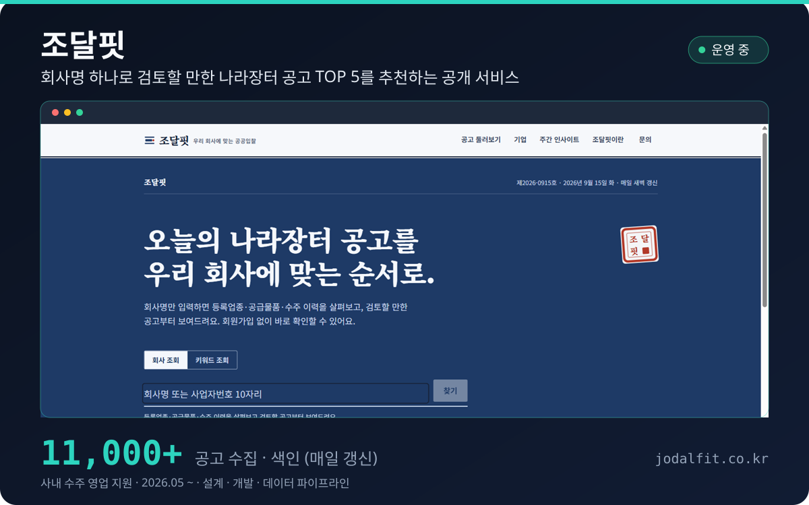</a>
      <b><a href="https://github.com/SSEUNGSSEUNGWOO/jodalfit">조달핏</a></b> · <a href="https://jodalfit.co.kr">jodalfit.co.kr</a> — 등록업종·공급물품·수주이력 임베딩 매칭. 수주이력 중심 설계는 실데이터 매칭 1.1%로 확인 후 업종 중심으로 조정. 근거는 <a href="https://github.com/SSEUNGSSEUNGWOO/jodalfit#2-핵심-알고리즘-2026-05-25-pivot--업종-메인--동적-가중치">README 2장</a>.
    </td>
    <td width="50%">
      <a href="https://daeasy.co.kr">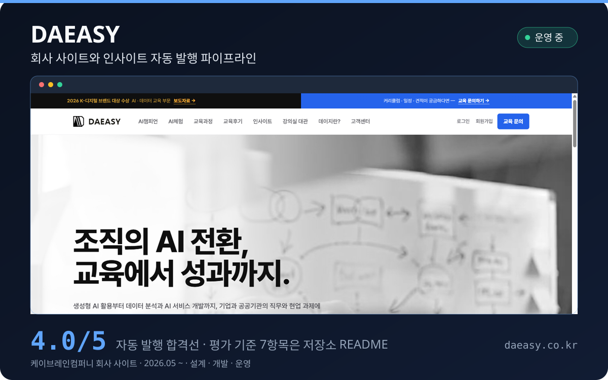</a>
      <b><a href="https://github.com/SSEUNGSSEUNGWOO/daeasy">DAEASY</a></b> · <a href="https://daeasy.co.kr">daeasy.co.kr</a> — 크롤 → 작성 → 교정 → 평가 → 게시. 작성(claude)과 평가(codex)를 다른 모델에 맡기고 합격 판정은 코드가. 평가 기준 7항목은 <a href="https://github.com/SSEUNGSSEUNGWOO/daeasy#파이프라인에서-결정한-것">README</a>.
    </td>
  </tr>
</table>

<table width="100%">
  <tr valign="top">
    <td width="50%">
      <a href="https://github.com/SSEUNGSSEUNGWOO/agent-pipeline">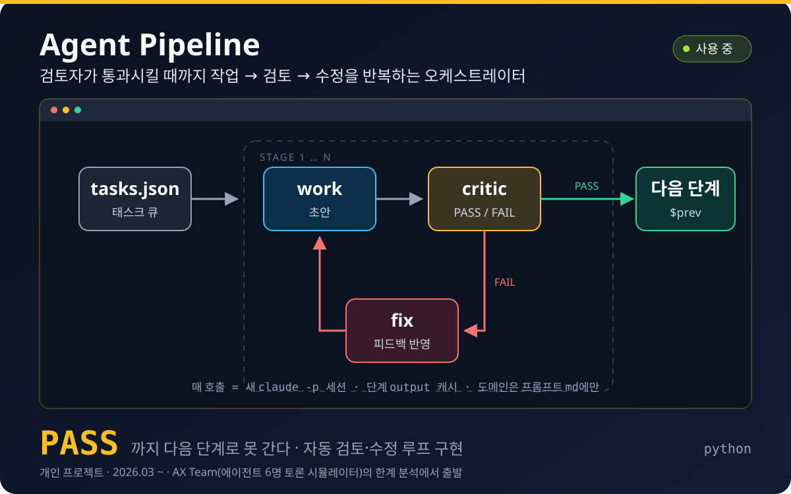</a>
      <b><a href="https://github.com/SSEUNGSSEUNGWOO/agent-pipeline">Agent Pipeline</a></b> — 단계를 선언하면 Critic이 PASS를 낼 때까지 루프를 돌린다. 도메인은 프롬프트 md에만, 매 호출 새 세션. <a href="https://github.com/SSEUNGSSEUNGWOO/AX-team">AX Team</a>의 한계 분석에서 출발.
    </td>
    <td width="50%">
      <a href="https://nolai.vercel.app">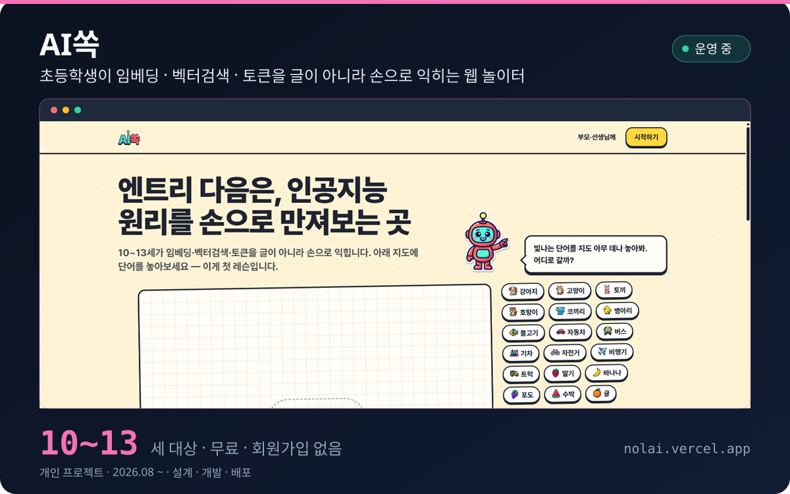</a>
      <b><a href="https://github.com/SSEUNGSSEUNGWOO/nolai">AI쏙</a></b> · <a href="https://nolai.vercel.app">nolai.vercel.app</a> — 10~13세 대상, 무료·회원가입 없음. 첫 레슨은 단어를 지도에 놓아 보는 임베딩 체험.
    </td>
  </tr>
</table>

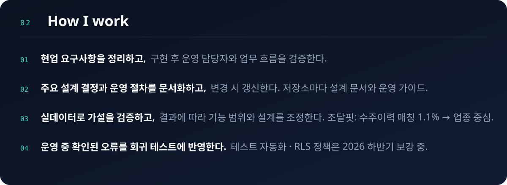

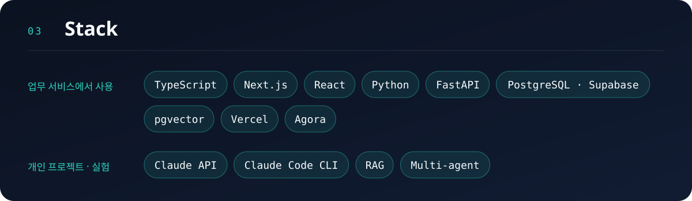

<a href="mailto:jansseung@gmail.com">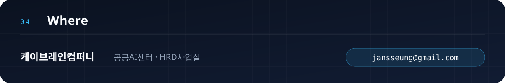</a>
