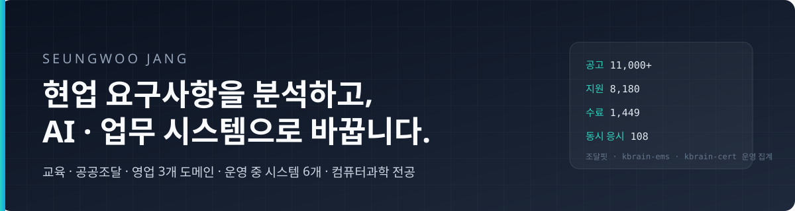
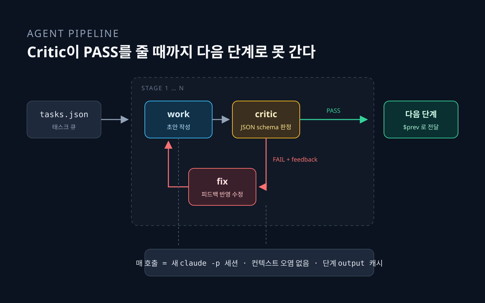

  
  
  
  
  

 

<table width="100%">
  <tr>
    <th width="50%" align="left">🎯 기획 · 운영</th>
    <th width="50%" align="left">⚙ 풀스택 개발</th>
  </tr>
  <tr valign="top">
    <td>
       
      행안부 · NIA <b>AI 챔피언</b> 사업 
      선발 · 교육 · 인증평가 운영 
      운영자 10명+ · 누적 기수 41개
    </td>
    <td>
       
      운영하면서 발견한 문제를 직접 시스템으로 
      Next.js 16 · Supabase · FastAPI · RAG 
      1인 풀스택 설계 · 구현 · 배포
    </td>
  </tr>
</table>

 

## 🛠 Projects

<table width="100%">
  <tr valign="top">
    <td width="50%">
      
      <h3><a href="https://github.com/SSEUNGSSEUNGWOO/kbrain-ems">kbrain-ems</a></h3>
      교육 운영 관리 시스템. 모집 → 선발 → 출결 → 과제 → 수료 → 인증 → 설문 → 진단 → 결과보고를 한 곳에서.  
      <b>규모</b> 기수 41 · 지원 8,180 · 수료 1,449 · 운영자 10+ 
      <b>다음</b> 행안부·NIA 사업 전용 → 회사 사업별 운영관리로 확장  
      
      
      
    </td>
    <td width="50%">
      
      <h3><a href="https://github.com/SSEUNGSSEUNGWOO/kbrain-cert">kbrain-cert</a></h3>
      작업형 문항 전용 온라인 CBT. 실시간 화상 감독 · 감독관 모니터 · 이벤트 로그 · 수동 채점 · 답안 export.  
      <b>규모</b> 누적 응시 1,466명 · 최대 동시 108명 (설계 기준 100명을 실운영에서 초과) 
      <b>설계</b> 외부 코드로 운영하며 반복된 문제 4개를 설계 단계에서 제거  
      
      
      
    </td>
  </tr>
  <tr valign="top">
    <td width="50%">
      
      <h3><a href="https://github.com/SSEUNGSSEUNGWOO/jodalfit">조달핏</a> · <a href="https://jodalfit.co.kr">jodalfit.co.kr</a></h3>
      회사명 하나로 검토할 만한 나라장터(G2B) 공고 TOP 5. 등록업종 · 공급물품 · 수주이력 임베딩 매칭.  
      <b>규모</b> 진행 공고 11,000+ 매일 갱신 · 회사 34,517 · OpenAPI 8종 
      <b>배운 것</b> 수주이력 메인 설계는 실데이터 커버리지 1.1%로 폐기 → 업종 메인 + 동적 가중치로 피벗  
      
      
      
    </td>
    <td width="50%">
      
      <h3><a href="https://github.com/SSEUNGSSEUNGWOO/daeasy">DAEASY</a> · <a href="https://daeasy.co.kr">daeasy.co.kr</a></h3>
      회사 사이트 + 인사이트를 매일 채우는 AI 자동 발행 파이프라인. 크롤 → 작성 → 교정 → 평가 → 게시.  
      <b>결정</b> 작성(claude)과 평가(codex)를 다른 모델에. 합격 판정은 LLM이 아니라 코드가 
      <b>운영</b> AI 체험관은 런타임 LLM 호출 0 · 운영비 0  
      
      
      
    </td>
  </tr>
  <tr valign="top">
    <td width="50%">
      
      <h3><a href="https://github.com/SSEUNGSSEUNGWOO/agent-pipeline">Agent Pipeline</a></h3>
      단계를 선언하면 작업 → 검토 → 수정 루프를 Critic이 PASS를 낼 때까지 돌리는 범용 오케스트레이터. 태스크 한 줄 → 완성된 Python 프로젝트.  
      <b>구조</b> 도메인은 프롬프트 md에만 · 매 호출 새 세션 · 단계 캐시로 재개 
      <b>전작</b> <a href="https://github.com/SSEUNGSSEUNGWOO/AX-team">AX Team</a>(에이전트 6명 토론 시뮬레이터)의 한계 분석에서 출발  
      
      
    </td>
    <td width="50%">
        
      <h3>다음</h3>
      <b><a href="https://github.com/SSEUNGSSEUNGWOO/nolai">AI쏙</a></b> — 10~13세 어린이가 임베딩 · 토큰 · 픽셀 같은 AI 원리를 손으로 만지며 배우는 웹 놀이터. 배포 전.  
      <b>kbrain-ems 확장</b> — 사업 하나에 맞춘 운영 시스템을 회사 사업별 관리 시스템으로.
    </td>
  </tr>
</table>

 

## 🎯 What I think

> **운영자로서 발견한 문제만 진짜 문제다.** 운영도 코드도 한 사람이 하면 잘못 푸는 일이 줄어든다.
>
> 도메인 깊이가 없으면 AI는 가짜 문제만 푼다.
>
> 평가 없는 PoC는 데모일 뿐. **backtest 1번이 도입 결정의 무기.**
>
> AI 코딩 시대에 가장 비싼 사람은 **기획·운영 + 코드 + 도메인** hybrid.

 

## ⚙ Stack

  

`Claude API` · `RAG · GraphRAG` · `pgvector` · `Multi-agent orchestration` · `Claude Code CLI`

 

## 🏢 Where

  
  

